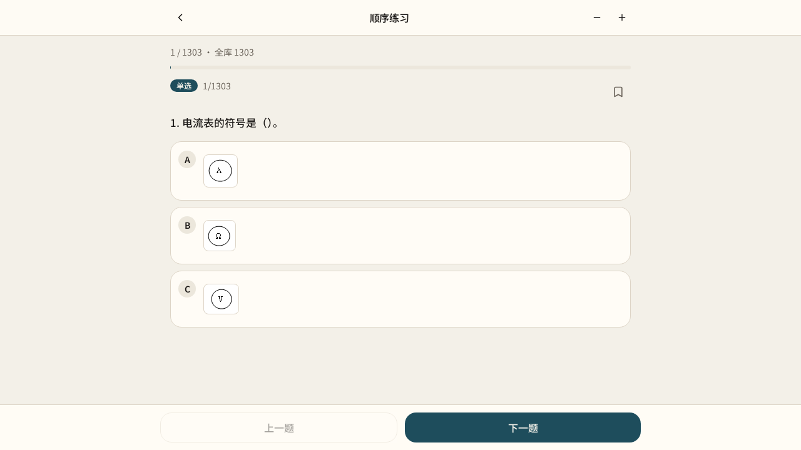
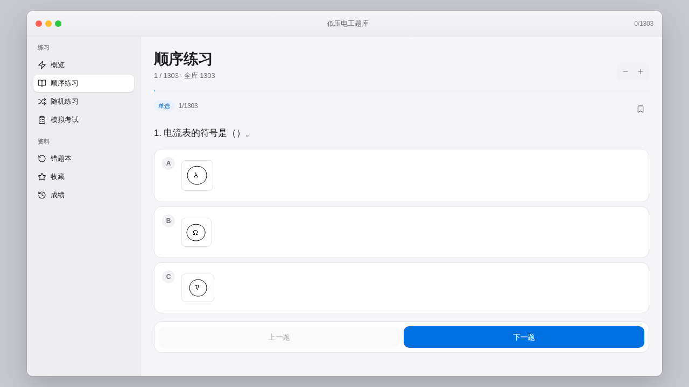
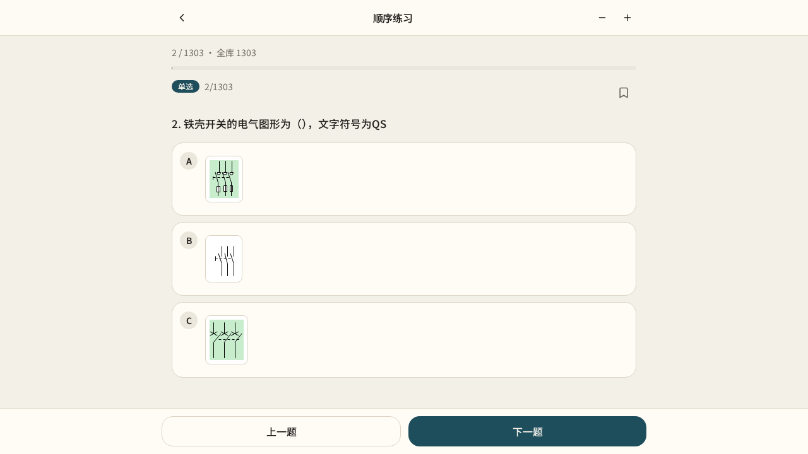
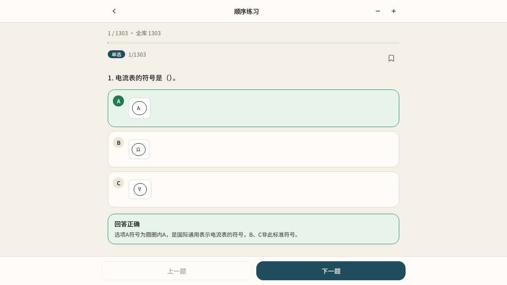
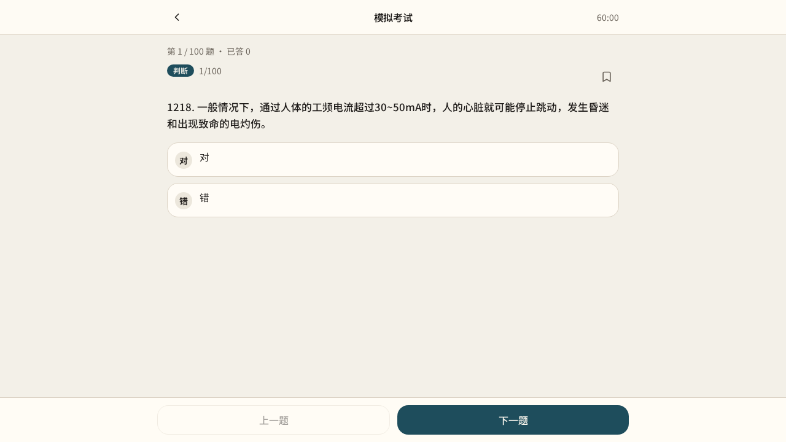
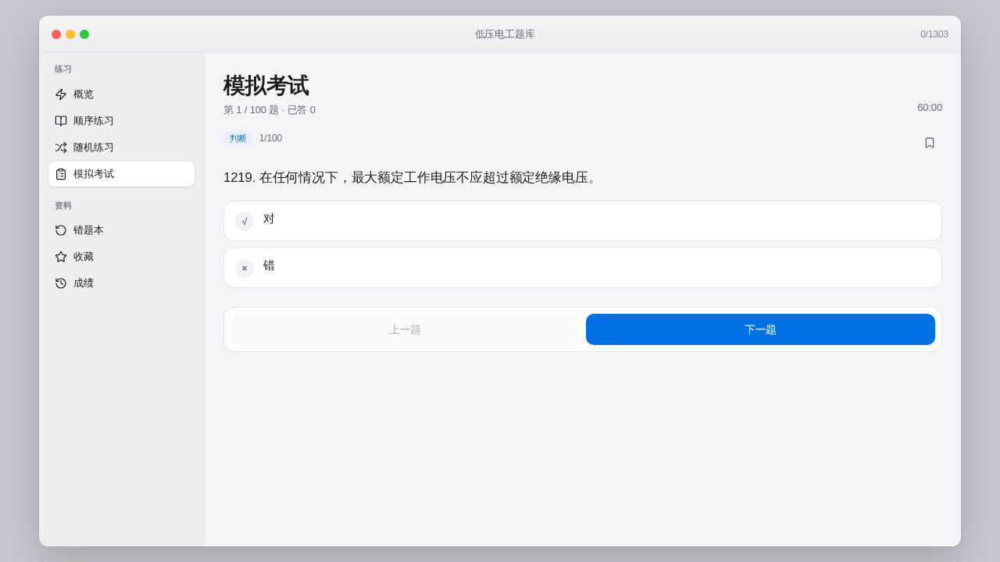
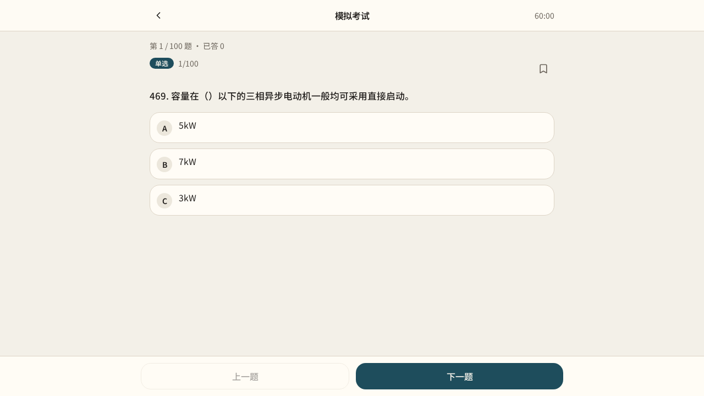

# 打包与部署说明

本文说明如何把 **lece01（特种作业题库）** 部署到网页，以及如何用 **HBuilderX** 打成 Android APK。

> **工种范围（颜色备注）**  
> 🔵 **低压电工** · 🔴 **高压电工** · 🟠 **电焊与热切割** · 🟢 **高处作业**  
> 四类工种题库 **均已接入**；打包名称建议统一用「特种作业题库」。

---

## 界面预览

### 练习

| 手机端 | 桌面端 |
|--------|--------|
|  |  |
|  |  |
|  | |

### 模拟考试

| 手机端 | 桌面端 |
|--------|--------|
|  |  |
|  | |

截图文件位于仓库目录 `screenshots/`。

---

## 一、网页部署（推荐）

### 1. 本地构建

```bash
npm install
npm run build
```

构建产物一般在 `dist/`（以实际 Vite 输出为准）。

### 2. 预览

```bash
npm run preview
```

### 3. 静态托管

将构建产物上传到任意静态托管即可，例如：

- Vercel / Netlify / Cloudflare Pages  
- 自有 Nginx / OSS 静态站点  

若使用 Vercel：连接本 GitHub 仓库，构建设置保持默认（`npm run build`），根目录即可。

> 进度数据存在用户浏览器本地，**不依赖服务器数据库**（当前练习进度为前端本地存储）。

---

## 二、HBuilderX 打 Android APK

适合需要安装到手机、离线使用的场景。打包完成后效果可参考上方「练习 / 考试」截图。

### 应用命名建议

| 项 | 建议填写 |
|----|----------|
| 应用名称 | 特种作业题库 |
| 应用描述 | 低压 / 高压 / 电焊与热切割 / 高处作业 练习与模拟考试 |
| 入口页面 | `index.html` |

### 方案 A：5+ App 壳 + 构建后的静态页（常用）

1. 在本机执行 `npm run build`，得到静态文件目录（如 `dist/`）。  
2. 打开 **HBuilderX** → **文件 → 新建 → 项目 → 5+App** → 选 **默认模板**。  
3. 项目名称例如：`特种作业题库`。创建后会自动生成有效 **AppID**。  
4. 删掉模板自带的示例页面，把 `dist/` 里的全部文件复制到 5+ 项目根目录（保证入口为 `index.html`）。  
5. 打开 `manifest.json`（可视化）：  
   - 确认 **应用标识（AppID）** 已存在  
   - **应用名称** 填：`特种作业题库`  
   - **应用描述** 可填：`低压、高压、电焊与热切割、高处作业`  
   - **应用入口** 填 `index.html`  
   - **模块配置**：不要勾选 **Contact（通讯录）**  
   - **权限配置**：去掉 `READ_CONTACTS` 等无关权限  
6. **发行 → 原生 App-云打包**  
   - 勾选 **Android (apk)**  
   - 证书选 **使用公共测试证书**（仅自用测试）  
   - 可选 **快速安心打包**  
7. 打包完成后在控制台下载 APK，传到手机安装。

### 方案 B：仅单页离线 HTML（多工种全量题库）

若使用「单文件内嵌题库」的 `index.html`（含低压 / 高压 / 电焊 / 高处）：

1. 新建 5+App 默认模板项目  
2. 用该 `index.html` **覆盖** 项目根目录的 `index.html`  
3. 按上面步骤配置 manifest 并云打包  

当前 **v1.0.0** 发布包见：https://github.com/xiaoping86/lece01/releases/tag/v1.0.0

---

## 三、云打包常见报错

### 1. AppID 无效

```
manifest.json中的AppID无效，请重新获取
```

**处理：**

- 必须用 HBuilderX **新建 5+App 项目** 自动获取 AppID，不要手写占位 ID。  
- 或登录 [DCloud 开发者中心](https://dev.dcloud.net.cn) → 创建应用 → 把 AppID 填进 `manifest.json` 源码视图的 `"id"` 字段。

### 2. 通讯录权限 / 需实名认证

```
本次打包选择了通讯录权限，请完成实名认证…
Contact / READ_CONTACTS
```

**处理：** 本应用 **不需要通讯录**。

1. 打开 `manifest.json`  
2. **模块配置** → 取消 **Contact（通讯录）**  
3. **权限配置** → 删除 `android.permission.READ_CONTACTS`  
4. 保存后重新提交打包  

### 3. 证书相关

- **自用安装**：选 **公共测试证书** 即可。  
- **上架应用商店**：需自有正式签名证书，按 HBuilderX「Android 证书使用指南」生成并填写。  
- 选「自有证书」却未填证书文件/密码会报红，改回公共测试证书或补全证书信息。

### 4. 文件拖不进 HBuilderX

不要拖进编辑器窗口。在 **资源管理器** 中把文件复制到：

`文档\HBuilderProjects\你的项目名\`

然后在 HBuilderX 里对项目 **右键 → 刷新**。

---

## 四、打包前检查清单

- [ ] `npm run build` 成功，或已放入完整 `index.html`  
- [ ] `manifest.json` 有有效 AppID  
- [ ] 应用名称：`特种作业题库`（低压 / 高压 / 电焊 / 高处）  
- [ ] 入口为 `index.html`  
- [ ] 未勾选通讯录模块 / 无 `READ_CONTACTS`  
- [ ] 证书选择正确（测试用公共证书）  
- [ ] 仅勾选 Android APK（除非你要打 iOS）  

---

## 五、版本与更新

- 网页版：重新 `build` 后部署即可；用户需自行刷新。  
- APK：修改代码后重新云打包，安装新包覆盖；本地进度在 WebView 存储中，覆盖安装一般仍保留（清数据会丢）。

如有新的打包报错截图，可对照上文第三节排查。
